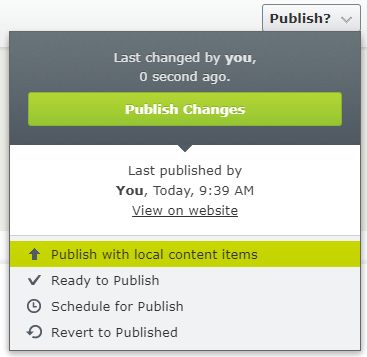

# EPiServer Labs - Block Enhancements

Nuget contains set of improvements for blocks.
* [Publish content with local blocks](#publish-content-with-local-blocks)<br>
* [Inline block editing](#inline-block-editing)<br>
* [Showing blokck status on content area](#showing-block-status-on-content-area)<br>
* [Inline publish](#inline-publish)<br>

The list of features is configurable. You can decide which of them should be enabled.
[Configuring enabled features](#inline-block-editing)<br>

## Publish content with local blocks




//TODO: add text

 ## Inline block editing


//TODO: add text

You can use `You can use` attribute.

```csharp
[SiteContentType(GUID = "67F617A4-2175-4360-975E-75EDF2B924A7",
    GroupName = SystemTabNames.Content)]
[SiteImageUrl]
[InlineBlockEditSettings(ShowNameProperty = false)]
public class EditorialBlock : SiteBlockData
{
    [Display(GroupName = SystemTabNames.Content)]
    [CultureSpecific]
    public virtual XhtmlString MainBody { get; set; }
}
```

```csharp
[SiteContentType(GUID = "9E7F6DF5-A963-40C4-8683-211C4FA48AE1")]
[SiteImageUrl]
[InlineBlockEditSettings(ShowNameProperty = true, ShowCategoryProperty = true, HiddenGroups = "")]
public class AdvancedBlock : SiteBlockData
{
    [Display(Order = 1, GroupName = SystemTabNames.Content)]
    public virtual string Text1 { get; set; }

    [Display(Order = 2, GroupName = SystemTabNames.Content)]
    public virtual string Text2 { get; set; }

    [Display(Order = 1, GroupName = Global.GroupNames.Products)]
    public virtual string Text3 { get; set; }

    [Display(Order = 2, GroupName = Global.GroupNames.Products)]
    public virtual string Text4 { get; set; }
}
```


 ## Showing block status on content area


//TODO: add text


 ## Inline publish


//TODO: add text

 ## Configuring enabled features
 
 To turn off one or more feature use `BlockEnhancementsOptions` options class and then, for example in the initialization module, set `false` on the feature that should not be available. By default all features are enabled. 
 
 ```csharp
[InitializableModule]
public class CustomBlockEnhancementsModule : IInitializableHttpModule
{
    public void Initialize(InitializationEngine context)
    {
        var options = ServiceLocator.Current.GetInstance<BlockEnhancementsOptions>();
        options.InlineEditing = false;
        options.PublishWithLocalContentItems = true;
        options.InlinePublish = false;
        options.StatusIndicator = false;
    }

    public void Uninitialize(InitializationEngine context)  {  }

    public void InitializeHttpEvents(HttpApplication application) {  }
}
 ```
