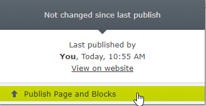
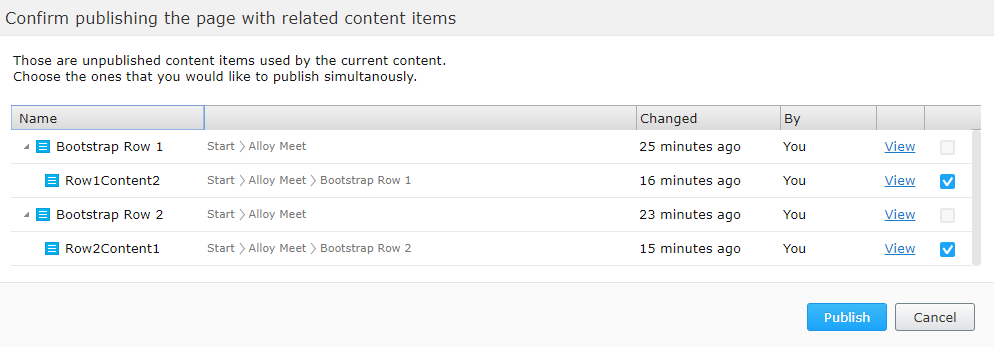
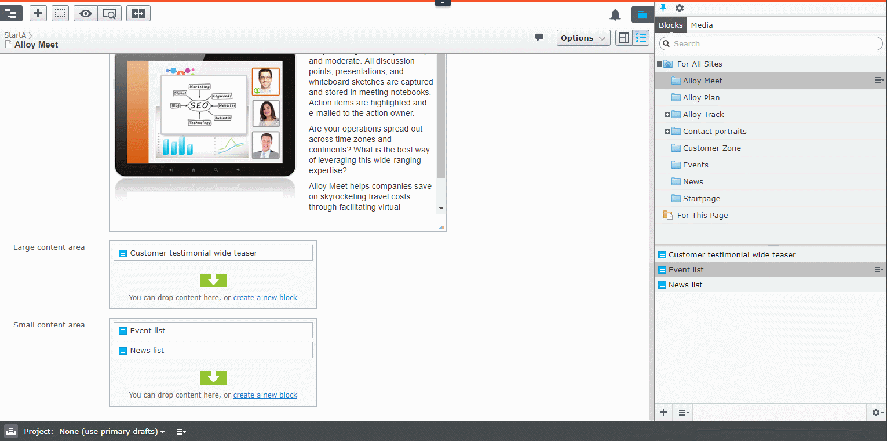
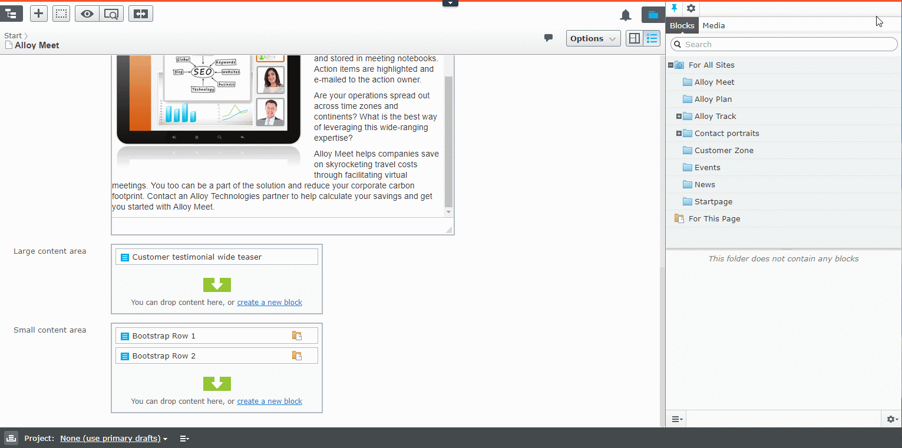
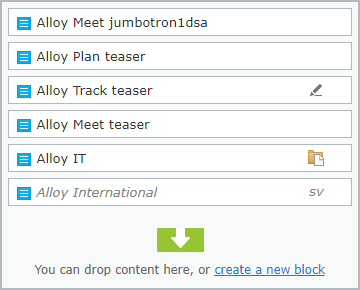

> **_NOTE:_**  EPiServer.Labs.BlockEnhancements will be obsoleted soon. Most of its functionality was moved to the Core package.
One of the features which is to allow editors to create inlined Blocks list was released as part of 12.18.0 as described here https://world.optimizely.com/blogs/bartosz-sekula/dates/2023/1/official-list-property-support/
Soon we will allow editors to create single inline blocks or blocks inside ContentArea which will officially make this Labs package officially ended.

# Episerver Labs - Block Enhancements

The project contains a few features that, in general, make the life of Episerver editors easier.

The list of current features is as following:
* [Publish Page and Shared Blocks](#publish-page-and-shared-blocks)
* [Showing block status on content area](#showing-block-status-on-content-area)

All of those features work together, but you can decide which ones are enabled, by [Configuring enabled features](#configuring-enabled-features)

## Publish Page and Shared Blocks

This is an extra command available in the global menu. It traverses current content dependency graph and lists all draft versions of blocks that could be published simultaneously. This command is hidden by default and will most likely be phased out since we want to promote the use of local blocks.



After running the command, a dialog box with a list of all draft versions of all dependent content items together with its own dependencies will be presented.
The default traversal depth is set to 2 and the dependencies are presented as a tree with roots set to first level dependencies and leaves as second level dependencies.
The editor can decide which blocks will be published using checkboxes next to the block name.



The command will publish the page and all the selected blocks.

Combining that "Smart" aspect of the new command with an existing "Inline Edit" feature makes quite a powerful combination:



A more advanced scenario can look something like this:



## Showing block status on content area

Another enhancement is the way to get a bit more details about particular content area items.
Each content area item will display status icons similar to the page tree. You will now see if block is a draft or if a language branch is missing.

Additionally to help distinguish local blocks from shared blocks, there is a new "Local block" icon.



Thanks to those flags, the editor can easily see if the page is ready to be published or not.

## Configuring enabled features

To turn off one or more feature, use the [BlockEnhancementsOptions](#BlockEnhancementsOptions) options class and then, for example, in the initialization module, set `false` on the feature that should not be available. All features are enabled by default.

```csharp
[InitializableModule]
[ModuleDependency(typeof(FrameworkInitialization))]
public class CustomBlockEnhancementsModule : IConfigurableModule
{
    public void ConfigureContainer(ServiceConfigurationContext context)
    {
        context.Services.Configure<BlockEnhancementsOptions>(options =>
        {
            options.StatusIndicator = false;            
            options.PublishPageWithBlocks = false;
        });
    }

    public void Initialize(InitializationEngine context) { }

    public void Uninitialize(InitializationEngine context) { }
}
```

### BlockEnhancementsOptions

 | Option        | Default           | Description  |
 | ---- | ---- | ---- |
 | PublishPageWithBlocks | false | Show 'Publish page & blocks' command in the top menu |
 | StatusIndicator | true | Show the content status next to Content Area items | 

### Please note
> Episerver Labs projects are meant to provide the developer community with pre-release features with the purpose of showcasing ongoing work and getting feedback in early stages of development.
>
> You should be aware that Labs are trials and not supported Episerver releases. While we hope you use them, there are a few things you should expect from each release:
> - Functionality may be added, removed, or changed.
> - Labs projects have not been through the same quality assurance process as the versioned products and, in some cases, may show unexpected behavior.
>   - The Episerver CMS UI team notes that:
>     - the scenarios in the Readme of each CMS Lab's repo will be verified and supported us
>     - the Labs add-on may or may not work with other add-ons, we are not testing them
>     - any such issues found, such as scenarios outside of the the Readme, can be fixed by the community by submitting a Pull Request on the Github repo
> - The software may not work on all environments.
>   - The Episerver CMS UI team notes that:
>     - Although it should work on base installations of CMS UI in Chrome and Firefox
> - There is no Episerver support; however, we will gratefully receive all feedback
>   - The Episerver CMS UI team notes that:
>     - Issues created on GitHub will be triaged, and if accepted, fixed by us
>
> The software is provided “As is” without warranty of any kind or promise of support. In no event shall Episerver be liable for any claim, damages or liability in relation to the software. By using this software you are also agreeing to our developer program terms [https://www.episerver.com/legal/program-terms/](https://www.episerver.com/legal/program-terms/)
