# Episerver Labs - Block Enhancements

The project contains a few features that, in general, make the life of Episerver editors easier.
The vision is to make it possible to edit and publish blocks directly on the page without a need for switching context.
The page is selected at all times and all actions around local blocks is performed inline.

The list of current features is as following:
* [Smart publish](#smart-publish)
* [Inline block editing](#inline-block-editing)
* [Showing block status on content area](#showing-block-status-on-content-area)
* [Inline publishing](#inline-publish)
* [Content Draft View](#content-draft-view)
* [Inline Create](#inline-create)
* [Telemetry opt-in](#telemetry-opt-in)
* [Translate](#translate)

All of those features work together, but you can decide which ones are enabled, by [Configuring enabled features](#configuring-enabled-features)

## Smart publish

This is an extra command available in the global menu. It traverses current content dependency graph and lists all draft versions of blocks that could be published simultaneously.


After running the command, a dialog box with a list of all draft versions of all dependent content items together with its own dependencies will be presented.
The default traversal depth is set to 2 and the dependencies are presented as a tree with roots set to first level dependencies and leaves as second level dependencies.
The editor can decide which blocks will be published using checkboxes next to the block name.


The command will publish the page and all the selected blocks.

Combining that "Smart" aspect of the new command with an existing "Inline Edit" feature makes quite a powerful combination:


A more advanced scenario can look something like this:


## Inline block editing

This feature allows editors to edit block content directly on the page.

In order for the changes to appear in OPE without refreshing the page, **Content Draft View** must be enabled and draft mode must be active.

Any block that the current editor has rights to can now be double-clicked which will open a dialog box with an editable block form.

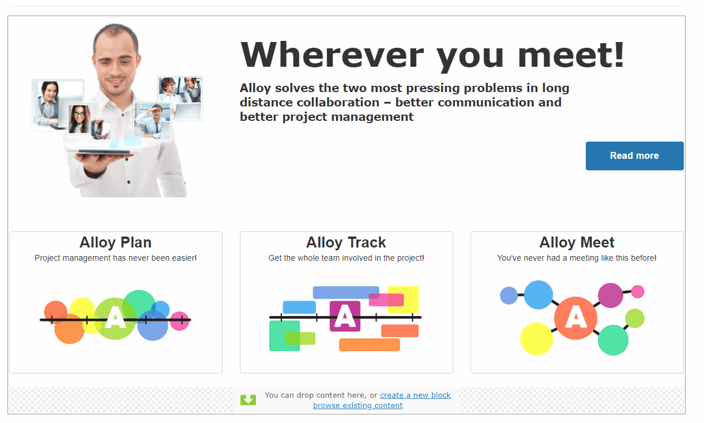

Alternatively, there is a new **"Inline block edit"** command added to content area items menu.

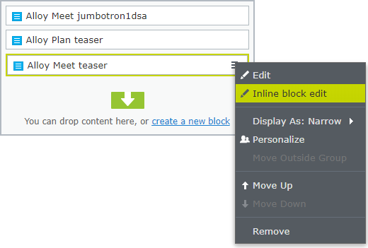

The editor can edit blocks the same way as when switching to blocks editing context.

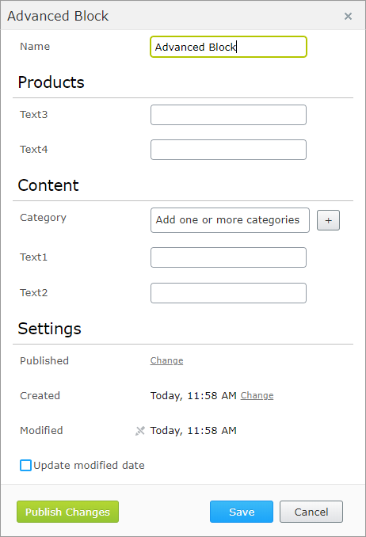

As you can see, the layout is a bit different than in the Forms view. Tabs are replaced with sections which makes more sense for blocks that usually have only a few properties.

The changes can also be published directly from the dialog box.

Additionally, the command is available from the assets pane.


In many scenarios, blocks are not using `Name` and `Categories` properties during rendering.
This is the reason why we introduced the `InlineBlockEditSettings` configuration attribute.
You can apply it to your block content type and hide those properties.
Additionally, you can also use this attribute to hide specific groups to make the editing form cleaner.

The attribute contains three properties:

Property | Default value | Description
------------ | ------------- | -------------
ShowNameProperty | false | When `true`, then `Name` property will be displayed
ShowCategoryProperty | false | When `true`, then `Categories` property will be displayed
HiddenGroups | Advanced | Comma-separated list of tabs that should be hidden

For example, the only property that is editable for the Editorial block type in the Alloy templates is "Main body".
There is no need to display other built-in properties or group properties into sections:

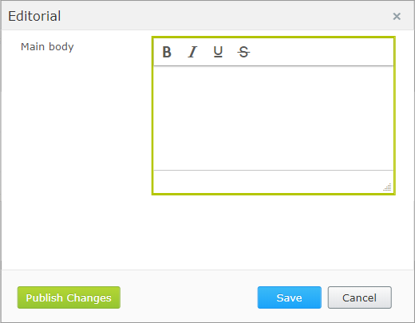

Another example is the Teaser block which has just a few simple properties:

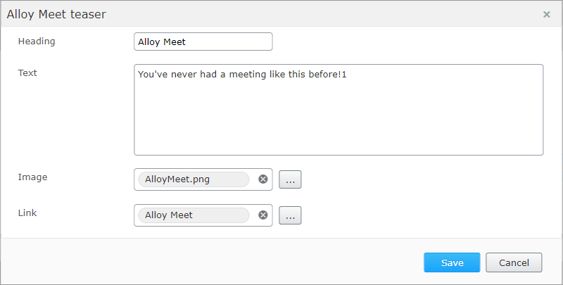

To turn on `Name` property:

```csharp
[SiteContentType(GUID = "67F617A4-2175-4360-975E-75EDF2B924A7",
    GroupName = SystemTabNames.Content)]
[SiteImageUrl]
[InlineBlockEditSettings(ShowNameProperty = true)]
public class EditorialBlock : SiteBlockData
{
    [Display(GroupName = SystemTabNames.Content)]
    [CultureSpecific]
    public virtual XhtmlString MainBody { get; set; }
}
```

And below how to display `Name` and `Categories` properties and `Settings` group.

```csharp
[SiteContentType(GUID = "9E7F6DF5-A963-40C4-8683-211C4FA48AE1")]
[SiteImageUrl]
[InlineBlockEditSettings(ShowNameProperty = true, ShowCategoryProperty = true, HiddenGroups = "")]
public class AdvancedBlock : SiteBlockData
{
    [Display(Order = 1, GroupName = SystemTabNames.Content)]
    public virtual string Text1 { get; set; }

    [Display(Order = 2, GroupName = SystemTabNames.Content)]
    public virtual string Text2 { get; set; }

    [Display(Order = 1, GroupName = Global.GroupNames.Products)]
    public virtual string Text3 { get; set; }

    [Display(Order = 2, GroupName = Global.GroupNames.Products)]
    public virtual string Text4 { get; set; }
}
```

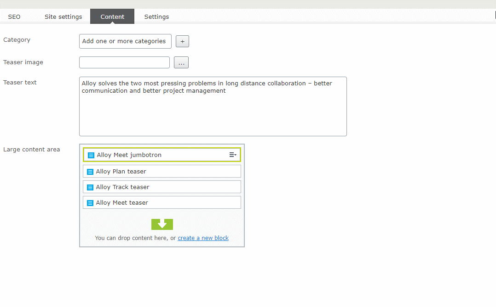

## Showing block status on content area

Another enhancement is the way to get a bit more details about particular content area items.
Each content area item will display status icons similar to the page tree. You will now see if block is a draft or if a language branch is missing.

Additionally to help distinguish local blocks from shared blocks, there is a new "Local block" icon.


Thanks to those flags, the editor can easily see if the page is ready to be published or not.

## Inline publish

This feature is just a convenient way to publish Content Area Items directly from the list, without the need of switching context.

There is a new command available in the content area menu.

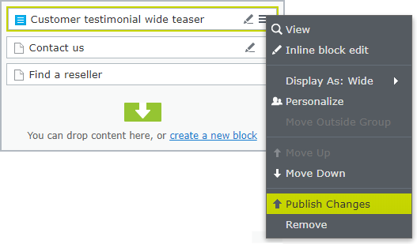

And also from the assets pane.

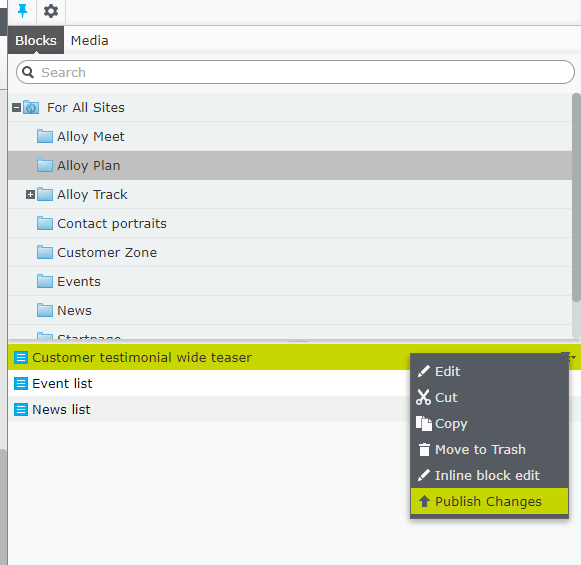

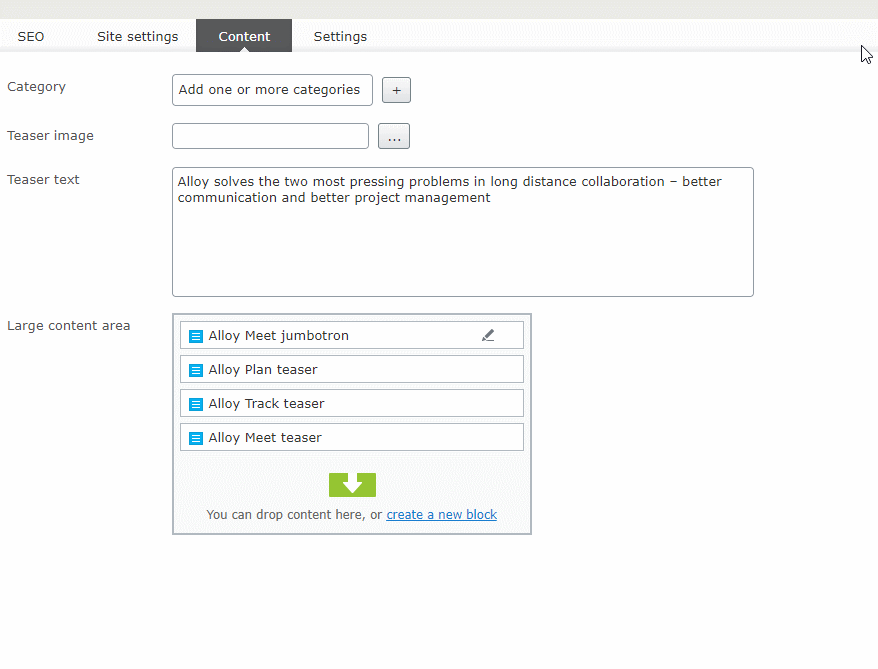

## Content Draft View

Allow editors to preview draft versions of content area blocks.

There is now a new button in the top bar.


By default in edit view, the editor sees the published blocks versions when a page is rendered.

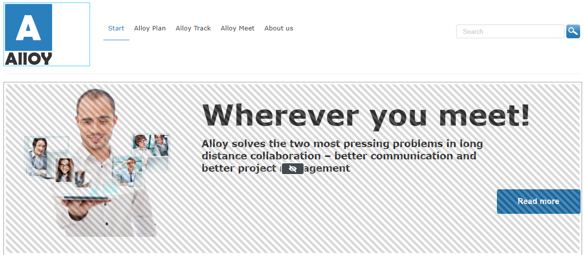

The editor can use the new **"Content Draft View"** button to get an overview of how the page will look after all blocks have been published.

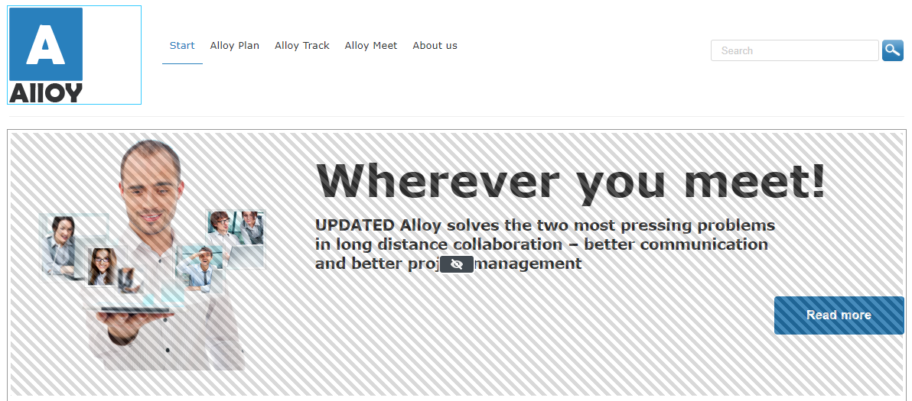

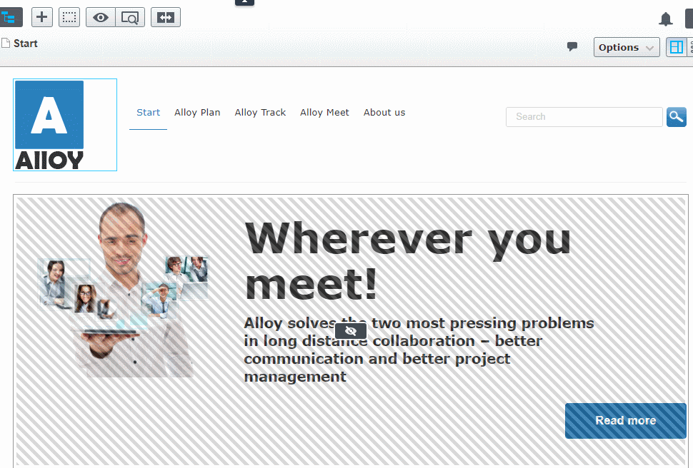

## Inline Create

Allow editors to create & publish new blocks inline, without the need to leave the current content context.

This feature also works in nested block scenarios, so let's say an editor can create a Row Block instance and then add child blocks to that Row. All those operations can be done without leaving the parent page context.

All new blocks are published automatically. It works both in On-Page Edit (OPE) and in regular Forms view.

After clicking "Create new block" link the editor will be prompted with a content type list dialog:

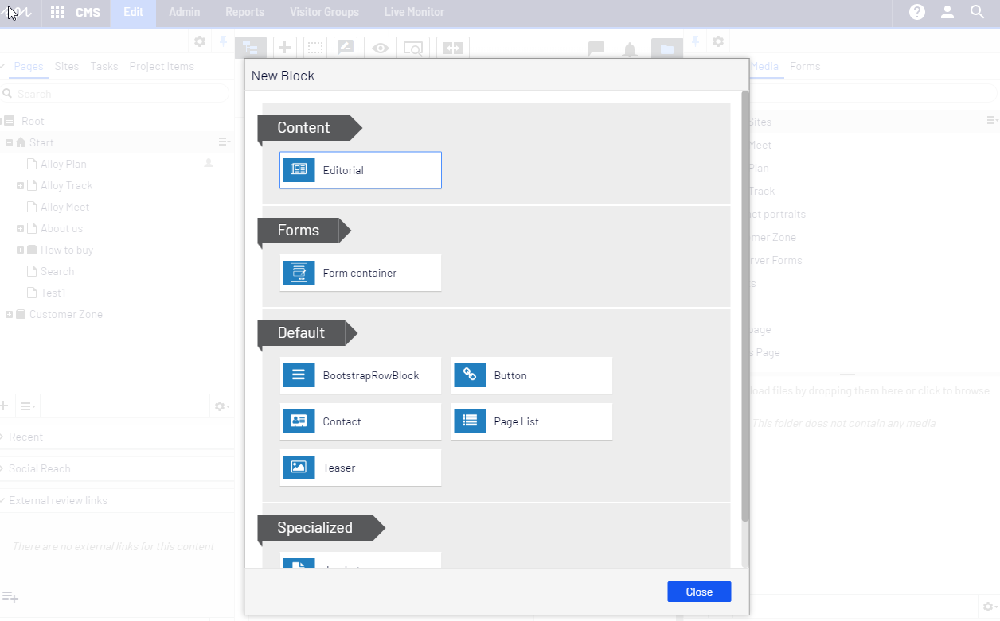

After choosing the content type the editor will see the inline edit form straight away. All properties will be included (both required and optional):

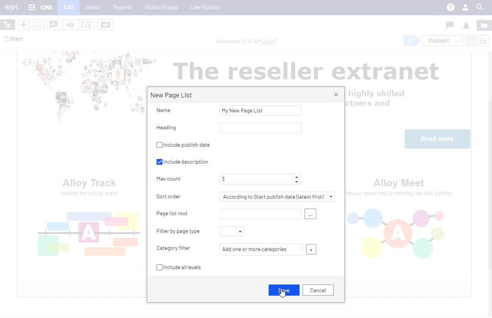

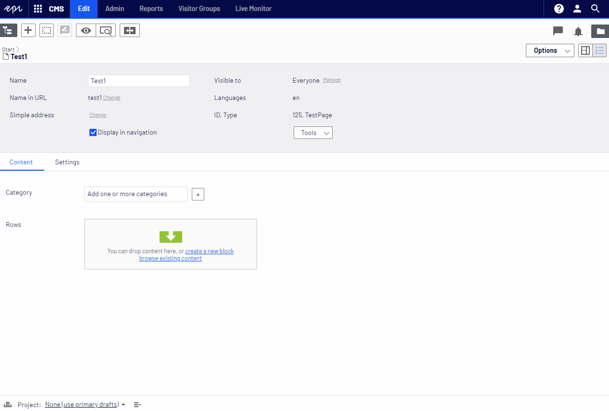

## Configuring enabled features

To turn off one or more feature, use the `BlockEnhancementsOptions` options class and then, for example, in the initialization module, set `false` on the feature that should not be available. All features are enabled by default.

```csharp
[InitializableModule]
[ModuleDependency(typeof(FrameworkInitialization))]
public class CustomBlockEnhancementsModule : IConfigurableModule
{
    public void ConfigureContainer(ServiceConfigurationContext context)
    {
        context.Services.Configure<BlockEnhancementsOptions>(options =>
        {
            options.InlineEditing = false;
            options.PublishWithLocalContentItems = true;
            options.ContentDraftView = true;
            options.InlinePublish = false;
            options.StatusIndicator = false;
            options.ContentAreaBrowse = true;
            options.InlineCreate = true;
        });
    }

    public void Initialize(InitializationEngine context) { }

    public void Uninitialize(InitializationEngine context) { }
}
```

## Telemetry opt-in

> NOTE: Telemetry is automatically enabled in DXC environment and can not be opted-out.

In non-DXC environments telemetry is not enabled by default. To opt-in to telemetry, add the following code to your initialization module.

```csharp
public void ConfigureContainer(ServiceConfigurationContext context)
{
    context.Services.Configure<TelemetryOptions>(options => options.OptedIn = true);
}
```

## Install

```Install-Package EPiServer.Labs.BlockEnhancements```

https://nuget.episerver.com/package/?id=EPiServer.Labs.BlockEnhancements

## Development (if you would like to help in development)

```console
>> build\tools\nuget.exe restore
>> setup.cmd
>> site.cmd
```

## Telemetry information

In a quest to understand our users more and effectivize our resources so that we can deliver the best user experience possible, we've decided to gather some useful telemetry so that we can make more informed decisions on what we should improve, support
and maybe not pursue when developing new features for CMS UI. We assure that the data we collect is completely anonymized and will only be used internally for making decisions on improving the user experience.

If you allow us to learn more about what we should be building, please make sure these two URL's are not blocked:

* Live Configuration: `https://cmsui.episerver.net/api/telemetryconfig`
* Tracking: `https://dc.services.visualstudio.com/v2/track` (this can change on Microsoft's discretion)

## Translate

In case that a content item does not exist in the current edit language a new command will be presented instead of the default 'inline-edit'.

In is the equivalent of navigating to the content item and clicking 'Translate' button in the Publishing Menu.

The new command lets the user to stay in the current context at all times:


One the content is is translated all other "inline" commands like "inline-edit" and "inline-publish" become available.

### Live configuration

When opted in, the server will make an initial GET request to `https://cmsui.episerver.net/api/telemetryconfig` in order to retrieve the telemetry config that will be used.

The *request* includes the following as queries (see "Taxonomy of custom events" section for details):

* `user`: String, an anonymized user id.
* `client`: String, anonymized client id.
* `version`: String, of the CMS version.

The *response* is a [JSON AppInsights configuration object](https://github.com/microsoft/ApplicationInsights-JS/blob/master/README.md#configuration) to allow for telemetry configuration changes live. It will always include:

* `instrumentationKey`: In case the AppInsights resource is re-deployed and the key changes.

Examples of configuration options currently not used but are reasons to have this service:

* `disableTelemetry`: In case telemetry needs to be turned off. Such as a catastrophic failure.
* `samplingPercentage`: Tweak the sampling size to control cost.

> The default Application Insights setup auto collects some information and will auto generate some events. You might therefore find some additional event data being sent that is not listed under custom events. You can find more information about what is collected [here](https://github.com/microsoft/ApplicationInsights-JS#setting-up-autocollection).

> You can [visit the URL](https://cmsui.episerver.net/api/telemetryconfig) to see this object live.

### Taxonomy of custom events

#### Always included

Every tracking event includes [standard Application Insights dimensions](https://docs.microsoft.com/en-us/azure/azure-monitor/app/api-custom-events-metrics#trackevent). The [authenticated user and client ID](https://docs.microsoft.com/en-us/azure/azure-monitor/app/api-custom-events-metrics#authenticated-users) are set as:

* `ai.user.authUserId`: String, a SHA512 hash without salt, using user email if available and username otherwise. To anonymize user but allow tracking between products.
* `ai.user.accountId`: String, a SHA512 hash without salt, using the License key. To allow for grouping of users.

> See the anonymization code [here.](https://github.com/episerver/EPiServer.Labs.BlockEnhancements/blob/master/src/episerver-labs-block-enhancements/Telemetry/Internal/TelemetryConfigStore.cs)

These `customDimensions` are added:

* `versions`: All installed add-ons and their versions. The value is an object, and will always include these keys:
    * `cms`: String, for the CMS version. E.g. `11.11.0.0`.
    * `episerver-labs-block-enhancements`: String, for this add-on version. E.g. `0.6.3.0`.
    * `shell`: String, for the CMS Shell version. E.g. `11.11.0.0`.

#### `feature-options`

Includes keys in `customDimensions` that correspond to a feature, and the value is a `boolean` (where `true` means the feature is enabled):

* `contentAreaBrowse`: Extra button in the content area that [displays the content selector](assets/docsimages/create_new_nested_block.gif) for [Inline Create](#inline-create).
* `contentDraftView`: [Content Draft View](#content-draft-view)
* `inlineCreate`: [Inline Create](#inline-create)
* `inlineEditing`: [Inline block editing](#inline-block-editing)
* `inlinePublish`: [Inline publishing](#inline-publish)
* `publishWithLocalContentItems`: [Smart publish](#smart-publish)
* `statusIndicator`: [Showing block status on content area](#showing-block-status-on-content-area)

#### `publish`

Includes the following `customDimensions`:

* `publish-result`: Boolean, `true` if the publish was successful. For Smart Publish this is the main content. If the main content is not changed, the result is `true`. It can succeed while the children fail (see `smart-publish.published`).
* `content-type`: String, `"page" | "block"`, specifies whether it's a page or a block that's being published.
* `command-type`: String, specifies one of the following features which originated the action:
    * `"default"`: Regular block and page publishes from CMS UI.
    * `"inline-edit-form"`: Publish from the Inline Edit form.
    * `"content-area"`: Publish from the Content Area content context menu.
    * `"assets-pane"`: Publish from the Assets Pane item context menu.
    * `"smart"`: Publish with the "Smart Publish" button in the Publish Menu, and includes additional `customMeasurements`:
        * `smart-publish.available`: Number, count of default selected content in the Smart Publish confirmation dialog.
        * `smart-publish.selected`: Number, count of user selected content in the Smart Publish confirmation dialog.
        * `smart-publish.published`: Number, count of successfully published content.

#### Adding new trackers

* Every commit adding or changing a tracking event must include a KQL query in the commit message that can be used to test and validate it.
* Event name must be documented in this Readme with its intention.
    * `publish` events will have the same name but use different data to distinguish between them. Any new publish trackers should add what data it collects to the list in the repo readme.
    * Names should use `camelCase`.

### Please note
> Episerver Labs projects are meant to provide the developer community with pre-release features with the purpose of showcasing ongoing work and getting feedback in early stages of development.
>
> You should be aware that Labs are trials and not supported Episerver releases. While we hope you use them, there are a few things you should expect from each release:
> - Functionality may be added, removed, or changed.
> - Labs projects have not been through the same quality assurance process as the versioned products and, in some cases, may show unexpected behavior.
>   - The Episerver CMS UI team notes that:
>     - the scenarios in the Readme of each CMS Lab's repo will be verified and supported us
>     - the Labs add-on may or may not work with other add-ons, we are not testing them
>     - any such issues found, such as scenarios outside of the the Readme, can be fixed by the community by submitting a Pull Request on the Github repo
> - The software may not work on all environments.
>   - The Episerver CMS UI team notes that:
>     - Although it should work on base installations of CMS UI in Chrome and Firefox
> - There is no Episerver support; however, we will gratefully receive all feedback
>   - The Episerver CMS UI team notes that:
>     - Issues created on GitHub will be triaged, and if accepted, fixed by us
>
> The software is provided “As is” without warranty of any kind or promise of support. In no event shall Episerver be liable for any claim, damages or liability in relation to the software. By using this software you are also agreeing to our developer program terms [https://www.episerver.com/legal/program-terms/](https://www.episerver.com/legal/program-terms/)
