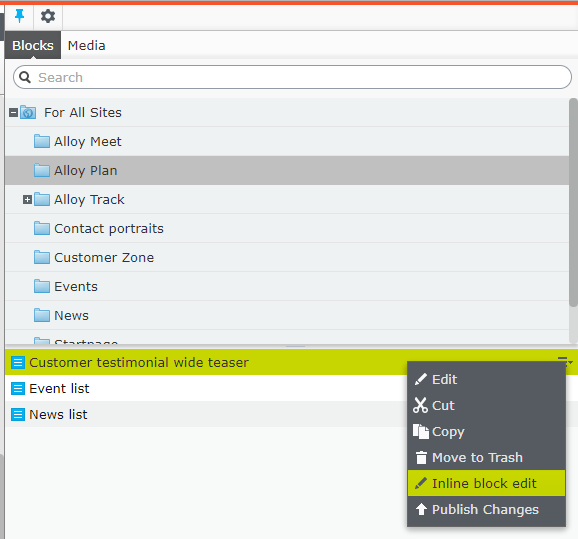

# EPiServer Labs - Block Enhancements

Project contains a few features that, in general, make the life of EPiServer Editors easier.
The vision is to make it possible to edit and publish blocks directly on the page without a need of switching the context. 
The page will be the selected at all times and all actions around local blocks will be performed inline.

The list of current features is as following:
* [Publish content with local blocks](#publish-content-with-local-blocks)<br>
* [Inline block editing](#inline-block-editing)<br>
* [Showing block status on content area](#showing-block-status-on-content-area)<br>
* [Inline publish](#inline-publish)<br>
* [Content Draft View](#content-draft-view)<br>

All of those features works together, but you can decide which of them are enabled, by [Configuring enabled features](#configuring-enabled-features)<br>

## Publish content with local blocks

This is extra command available in the Global Menu. It will automatically check the "For this page" 
folder of the current page and list all unpublished blocks that could be published with the page.


After running the command, the dialog with a list of all unpublished local blocks is displayed. 
The Editor can decide which blocks will be published using checkboxes next to local block name.


Command will publish page and all selected blocks.

Known issue |
------------ |
If block contains "For this block" folder, the content from this block won't be published. |

Using this feature the Editor won't have to manually click through all local blocks just to check if all of them have already been published.


## Inline block editing

This feature allows Editors to edit blocks content directly on page. 

There is new **"Inline block edit"** command added to content area items menu.


Command opens a dialog with editable block form. 
The Editor can edit blocks the same way as when switching to blocks editing context.


As you can see the layout is a bit different than in the Forms View. Tabs were replaced with sections which makes more sense for blocks that usually have only a few properties.

The changes can also be published directly from the dialog.

Additionally command is available from the Assets Pane.



In many scenarios blocks are not using `Name` and `Categories` properties during rendering.
This was the reason why we introduced `InlineBlockEditSettings` configuration attribute.
You can apply it to your block content type and hide those properties. 
Additionally you can use this attribute to hide specific groups.
That should help making the editing form cleaner.

The attribute contains three properties:

Property | Default value | Description
------------ | ------------- | ------------- 
ShowNameProperty | false | When `true`, then `Name` property will be displayed
ShowCategoryProperty | false | When `true`, then `Categories` property will be displayed
HiddenGroups | Advanced | Coma separated list of tabs that should be hidden

For example, for Alloy Editorial block type, the only one property, that is editable is "Main body".
There is no need to display other built in properties or group properties into sections:


Another example is Teaser block which has just a few simple properties: 


To turn on `Name` property:

```csharp
[SiteContentType(GUID = "67F617A4-2175-4360-975E-75EDF2B924A7",
    GroupName = SystemTabNames.Content)]
[SiteImageUrl]
[InlineBlockEditSettings(ShowNameProperty = true)]
public class EditorialBlock : SiteBlockData
{
    [Display(GroupName = SystemTabNames.Content)]
    [CultureSpecific]
    public virtual XhtmlString MainBody { get; set; }
}
```

And below how to display `Name` and `Categories` properties and `Settings` group.

```csharp
[SiteContentType(GUID = "9E7F6DF5-A963-40C4-8683-211C4FA48AE1")]
[SiteImageUrl]
[InlineBlockEditSettings(ShowNameProperty = true, ShowCategoryProperty = true, HiddenGroups = "")]
public class AdvancedBlock : SiteBlockData
{
    [Display(Order = 1, GroupName = SystemTabNames.Content)]
    public virtual string Text1 { get; set; }

    [Display(Order = 2, GroupName = SystemTabNames.Content)]
    public virtual string Text2 { get; set; }

    [Display(Order = 1, GroupName = Global.GroupNames.Products)]
    public virtual string Text3 { get; set; }

    [Display(Order = 2, GroupName = Global.GroupNames.Products)]
    public virtual string Text4 { get; set; }
}
```


## Showing block status on content area

Another enhancement is the way to get a bit more details about particular content area items.
Each content area item will display status similar to page tree. You will see if block is a draft
or language branch is missing.

Additionally to help distinguish local blocks from shared blocks there is new "Local block" icon.  


Thanks to those flags the Editor can easily see if the page is for sure ready to be published or not.

## Inline publish

This feature is just a convenient way to publish Content Area Items directly from the list, without the need to switch context.

There is a new command available in content area menu.


And also from the Assets Pane.


## Content Draft View

Allow Editors to preview draft versions of content area blocks.

There is new button in the top bar.


By default in edit mode, when page is rendered, the Editor will see published blocks versions.


To get the overview of how the page will look like after all blocks will be published,
the Editor can use new **"Content Draft View"** button.


## Configuring enabled features
 
 To turn off one or more feature use `BlockEnhancementsOptions` options class and then, for example in the initialization module, set `false` on the feature that should not be available. By default all features are enabled. 
 
```csharp
[InitializableModule]
public class CustomBlockEnhancementsModule : IInitializableHttpModule
{
    public void Initialize(InitializationEngine context)
    {
        var options = ServiceLocator.Current.GetInstance<BlockEnhancementsOptions>();
        options.InlineEditing = false;
        options.PublishWithLocalContentItems = true;
        options.ContentDraftView = true;
        options.InlinePublish = false;
        options.StatusIndicator = false;
    }

    public void Uninitialize(InitializationEngine context)  {  }

    public void InitializeHttpEvents(HttpApplication application) {  }
}
 ```
