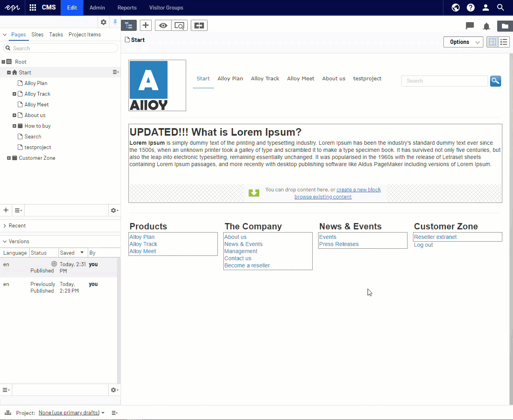

# Episerver Labs - Block Enhancements

The project contains a few features that, in general, make the life of Episerver editors easier.
The vision is to make it possible to edit and publish blocks directly on the page without a need for switching context.
The page is selected at all times and all actions around local blocks is performed inline.

The list of current features is as following:
* [Local content](#local-content)
* [Publish Page and Shared Blocks](#publish-page-and-shared-blocks)
* [Showing block status on content area](#showing-block-status-on-content-area)
* [Telemetry opt-in](#telemetry-opt-in)
* [Translate](#translate)

**Note**: The features from Labs are now moved to CMS UI core (Enabled from EPiServer.CMS.UI 11.36.0):
* Inline block editing
* Inline Create

All of those features work together, but you can decide which ones are enabled, by [Configuring enabled features](#configuring-enabled-features)

## Local content

Editors no longer have to manage Local Blocks and Local Assets independently.
All local contents (meaning content that resides in `For this page/block` folders) lifecycle will now be 
synchronized to its parent.

This greatly simplifies the process of creating and editing pages because editor/reviewer
no longer need to deal with individual blocks or assets but can focus on the big picture.

When publishing a page all local content will be published altogether.

The same with approval workflow, when content is marked as `Ready to review`, `Approved` or `Declined`
then the editor/reviewer will just receive a single notification about the page.
There will be no need to review the block individually.

Changing a local block will create a new page version which lets the editors to review and preview
what actually changed on a given page.

Please see the new feature in action:


This allows the editor to use the Compare Mode and see what actually changed:



Editor can also mark the page as `Ready to review` without dealing with local blocks one by one


Approving/declining is just as easy:


There is an Admin Mode plugin available that lets you analyze all the block instances and convert them to local blocks if possible.


All the blocks that are not truly Shared (meaning they are only used once) will be moved the the respective `For this page/block` folders. You can move the blocks one by one or move all the visible blocks at once. 

For performance reasons we only display the N first blocks that match the search filter.

## Publish Page and Shared Blocks

This is an extra command available in the global menu. It traverses current content dependency graph and lists all draft versions of blocks that could be published simultaneously. This command is hidden by default and will most likely be phased out since we want to promote the use of local blocks.


After running the command, a dialog box with a list of all draft versions of all dependent content items together with its own dependencies will be presented.
The default traversal depth is set to 2 and the dependencies are presented as a tree with roots set to first level dependencies and leaves as second level dependencies.
The editor can decide which blocks will be published using checkboxes next to the block name.
If [LocalContentFeatureEnabled](#BlockEnhancementsOptions) is true then the dialog will only present Shared dependencies because local items are handled automatically.
However if [LocalContentFeatureEnabled](#BlockEnhancementsOptions) is false then all dependencies will be presented.


The command will publish the page and all the selected blocks.

Combining that "Smart" aspect of the new command with an existing "Inline Edit" feature makes quite a powerful combination:


A more advanced scenario can look something like this:


## Showing block status on content area

Another enhancement is the way to get a bit more details about particular content area items.
Each content area item will display status icons similar to the page tree. You will now see if block is a draft or if a language branch is missing.

Additionally to help distinguish local blocks from shared blocks, there is a new "Local block" icon.


Thanks to those flags, the editor can easily see if the page is ready to be published or not.

## Configuring enabled features

To turn off one or more feature, use the [BlockEnhancementsOptions](#BlockEnhancementsOptions) options class and then, for example, in the initialization module, set `false` on the feature that should not be available. All features are enabled by default.

```csharp
[InitializableModule]
[ModuleDependency(typeof(FrameworkInitialization))]
public class CustomBlockEnhancementsModule : IConfigurableModule
{
    public void ConfigureContainer(ServiceConfigurationContext context)
    {
        context.Services.Configure<BlockEnhancementsOptions>(options =>
        {
            options.LocalContentFeatureEnabled = false;            
            options.StatusIndicator = false;
            options.ContentAreaSettings = new ContentAreaSettings
                {
                    ContentAreaBrowse = true
                };
            options.InlineTranslate = true;
        });
    }

    public void Initialize(InitializationEngine context) { }

    public void Uninitialize(InitializationEngine context) { }
}
```

### BlockEnhancementsOptions

 | Option        | Default           | Description  |
 | ---- | ---- | ---- |
 | LocalContentFeatureEnabled | true | Connect local content items to its parent page | 
 | AllowQuickEditOnSharedBlocks | false | Enable `Quick Edit` command also on shared blocks. It might be useful to turn this on if there are many shared blocks in the system | 
 | HideForThisFolder | true | Do not show `For this page` folder in the Blocks Asset Pane |
 | IgnoreQuickEditOnBlockTypes | [] | Favor standard `Edit` command over `Quick Edit` for specific block types. If you provide `typeof(BlockData)` type then Quick Edit will be disabled for all block types. |
 | IgnoreQuickEditOnBlockTypeIdentifiers | [] | Favor standard `Edit` command over `Quick Edit` for specific block type identifiers (e.g. alloytemplates.models.blocks.buttonblock). If you provide `episrver.core.blockdata` type identifier then Quick Edit will be disabled for all block types. |
 | PublishPageWithBlocks | false | Show 'Publish page & blocks' command in the top menu |
 | StatusIndicator | true | Show the content status next to Content Area items |
 | ContentAreaSettings | [ContentAreaSettings](#ContentAreaSettings) | Settings related to Content Areas |
 | InlineTranslate | false | Translate content items inline, without switching context |

### ContentAreaSettings

 | Option        | Default           | Description  |
 | ---- | ---- | ---- |
 | ContentAreaBrowse | true | Allow editors to browse content directly from Content Area |
 | ContentAreaEditorDescriptorBehavior | EditorDescriptorBehavior.OverrideDefault | Should the custom ContentArea override the default |
 | UIHint | null | Custom UIHint, only necessary if DescriptorBehavior is not the default one |
 
## Telemetry opt-in

> NOTE: Telemetry is automatically enabled in DXC environment and can not be opted-out.

In non-DXC environments telemetry is not enabled by default. To opt-in to telemetry, add the following code to your initialization module.

```csharp
public void ConfigureContainer(ServiceConfigurationContext context)
{
    context.Services.Configure<TelemetryOptions>(options => options.OptedIn = true);
}
```

## Install

```Install-Package EPiServer.Labs.BlockEnhancements```

https://nuget.episerver.com/package/?id=EPiServer.Labs.BlockEnhancements

## Development (if you would like to help in development)

```console
>> build\tools\nuget.exe restore
>> setup.cmd
>> site.cmd
```

## Translate

In case that a content item does not exist in the current edit language a new command will be presented instead of the default 'inline-edit'.

It is the equivalent of navigating to the content item and clicking 'Translate' button in the Publishing Menu.

The new command lets the user to stay in the current context at all times:


## Telemetry information

In a quest to understand our users more and effectivize our resources so that we can deliver the best user experience possible, we've decided to gather some useful telemetry so that we can make more informed decisions on what we should improve, support
and maybe not pursue when developing new features for CMS UI. We assure that the data we collect is completely anonymized and will only be used internally for making decisions on improving the user experience.

If you allow us to learn more about what we should be building, please make sure these two URL's are not blocked:

* Live Configuration: `https://cmsui.episerver.net/api/telemetryconfig`
* Tracking: `https://dc.services.visualstudio.com/v2/track` (this can change on Microsoft's discretion)

### Taxonomy of custom events

#### Always included

Every tracking event includes [standard Application Insights dimensions](https://docs.microsoft.com/en-us/azure/azure-monitor/app/api-custom-events-metrics#trackevent). The [authenticated user and client ID](https://docs.microsoft.com/en-us/azure/azure-monitor/app/api-custom-events-metrics#authenticated-users) are set as:

* `ai.user.authUserId`: String, a SHA512 hash without salt, using user email if available and username otherwise. To anonymize user but allow tracking between products.
* `ai.user.accountId`: String, a SHA512 hash without salt, using the License key. To allow for grouping of users.

Additionally we are tracking:

#### `feature-options`

Includes keys in `customDimensions` that correspond to a feature, and the value is a `boolean` (where `true` means the feature is enabled):

* `contentAreaBrowse`: Extra button in the content area that [displays the content selector](assets/docsimages/create_new_nested_block.gif) for [Inline Create](#inline-create).
* `hideForThisFolder`: Do not show `For this page` folder in Blocks Asset Pane
* `localContentFeatureEnabled`: [Local content](#local-content)
* `inlineTranslate`: [Inline translate](#translate)
* `publishPageWithBlocks`: [Publish Page and Shared Blocks](#publish-page-and-shared-blocks)
* `statusIndicator`: [Showing block status on content area](#showing-block-status-on-content-area)

#### `publish`

Includes the following `customDimensions`:

* `publish-result`: Boolean, `true` if the publish was successful. For `Publish Page and Shared Blocks` this is the main content. If the main content is not changed, the result is `true`. It can succeed while the children fail (see `smart-publish.published`).
* `content-type`: String, `"page" | "block"`, specifies whether it's a page or a block that's being published.
* `command-type`: String, specifies one of the following features which originated the action:
    * `"default"`: Regular block and page publishes from CMS UI.
    * `"inline-edit-form"`: Publish from the Inline Edit form.
    * `"content-area"`: Publish from the Content Area content context menu.
    * `"assets-pane"`: Publish from the Assets Pane item context menu.
    * `"smart"`: Publish with the "Publish Page and Shared Blocks" button in the Publish Menu, and includes additional `customMeasurements`:
        * `smart-publish.available`: Number, count of default selected content in the Publish Page and Shared Blocks confirmation dialog.
        * `smart-publish.selected`: Number, count of user selected content in the Publish Page and Shared Blocks confirmation dialog.
        * `smart-publish.published`: Number, count of successfully published content.

### Please note
> Episerver Labs projects are meant to provide the developer community with pre-release features with the purpose of showcasing ongoing work and getting feedback in early stages of development.
>
> You should be aware that Labs are trials and not supported Episerver releases. While we hope you use them, there are a few things you should expect from each release:
> - Functionality may be added, removed, or changed.
> - Labs projects have not been through the same quality assurance process as the versioned products and, in some cases, may show unexpected behavior.
>   - The Episerver CMS UI team notes that:
>     - the scenarios in the Readme of each CMS Lab's repo will be verified and supported us
>     - the Labs add-on may or may not work with other add-ons, we are not testing them
>     - any such issues found, such as scenarios outside of the the Readme, can be fixed by the community by submitting a Pull Request on the Github repo
> - The software may not work on all environments.
>   - The Episerver CMS UI team notes that:
>     - Although it should work on base installations of CMS UI in Chrome and Firefox
> - There is no Episerver support; however, we will gratefully receive all feedback
>   - The Episerver CMS UI team notes that:
>     - Issues created on GitHub will be triaged, and if accepted, fixed by us
>
> The software is provided “As is” without warranty of any kind or promise of support. In no event shall Episerver be liable for any claim, damages or liability in relation to the software. By using this software you are also agreeing to our developer program terms [https://www.episerver.com/legal/program-terms/](https://www.episerver.com/legal/program-terms/)
