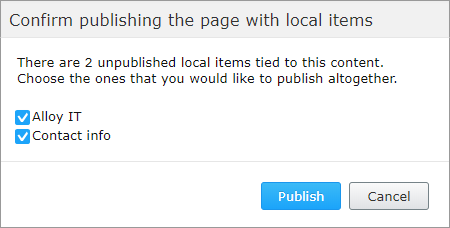

# EPiServer Labs - Block Enhancements

This project contains a few useful features that, in general, make the life of EPiServer editors easier.
The list of current features is as following:
* [Publish content with local blocks](#publish-content-with-local-blocks)<br>
* [Inline block editing](#inline-block-editing)<br>
* [Showing block status on content area](#showing-block-status-on-content-area)<br>
* [Inline publish](#inline-publish)<br>

The list of features is configurable. You can decide which of them should be enabled.
[Configuring enabled features](#configuring-enabled-features)<br>

## Publish content with local blocks

This extra command available in the Global Menu will automatically check the "For this page" 
folder of the current page and list all unpublished blocks that could be published in a single operation.


After running the command, the dialog window with list of local blocks is displayed. 
The Editor can decide which blocks will be published using checkboxes next to local block name.



Command will publish all page and all selected blocks.

Known issue |
------------ |
If block contains "For this block" folder, the content from this block won't be published. |

This way the editor won't have to manually click through all local blocks just to check if all of them have already been published.

## Inline block editing


This extra command will open a dialog with editable form where you can edit your Local Block the same way as if you opened it.


As you can see the layout is a bit different than in the Forms View. Tabs were replaced with sections which makes more sense for blocks that usually have only a few properties.


The changes can also be published directly.


The command is also available from the Assets Pane.


The ultimate goal of this project is to make it possible to handle local blocks in such a way that the editor will never have to switch the editing context. 

The page will be the selected at all times and all actions around local blocks will be performed inline.

Thanks to that, we decided that the `Name` property for such blocks may no longer be useful. This was the reason why we introduced another configuration interface `InlineBlockEditSettings` that you can apply to your Block Content Type and disable the name property. 

```csharp
[SiteContentType(GUID = "67F617A4-2175-4360-975E-75EDF2B924A7",
    GroupName = SystemTabNames.Content)]
[SiteImageUrl]
[InlineBlockEditSettings(ShowNameProperty = false)]
public class EditorialBlock : SiteBlockData
{
    [Display(GroupName = SystemTabNames.Content)]
    [CultureSpecific]
    public virtual XhtmlString MainBody { get; set; }
}
```

You can use `InlineBlockEditSettings` attribute to enhance the behavior even more by disabling other properties that may not be very useful in case of local blocks like `Categories` or even hide whole property groups.

```csharp
[SiteContentType(GUID = "9E7F6DF5-A963-40C4-8683-211C4FA48AE1")]
[SiteImageUrl]
[InlineBlockEditSettings(ShowNameProperty = true, ShowCategoryProperty = true, HiddenGroups = "")]
public class AdvancedBlock : SiteBlockData
{
    [Display(Order = 1, GroupName = SystemTabNames.Content)]
    public virtual string Text1 { get; set; }

    [Display(Order = 2, GroupName = SystemTabNames.Content)]
    public virtual string Text2 { get; set; }

    [Display(Order = 1, GroupName = Global.GroupNames.Products)]
    public virtual string Text3 { get; set; }

    [Display(Order = 2, GroupName = Global.GroupNames.Products)]
    public virtual string Text4 { get; set; }
}
```


## Showing block status on content area


Another useful enhancement is the way to get a bit more details about particular content area items.
We added a few informative flags:
* Is item a local block
* Is item a draft
* Is the language missing

Thanks to those flags the Editor can easily see if the page is for sure ready to be published or not.

## Inline publish


This is just a convenient way to publish Content Area Items directly from the list, without the need to switch context.


And it is also available from the Assets Pane.

## Configuring enabled features
 
 To turn off one or more feature use `BlockEnhancementsOptions` options class and then, for example in the initialization module, set `false` on the feature that should not be available. By default all features are enabled. 
 
```csharp
[InitializableModule]
public class CustomBlockEnhancementsModule : IInitializableHttpModule
{
    public void Initialize(InitializationEngine context)
    {
        var options = ServiceLocator.Current.GetInstance<BlockEnhancementsOptions>();
        options.InlineEditing = false;
        options.PublishWithLocalContentItems = true;
        options.InlinePublish = false;
        options.StatusIndicator = false;
    }

    public void Uninitialize(InitializationEngine context)  {  }

    public void InitializeHttpEvents(HttpApplication application) {  }
}
 ```
